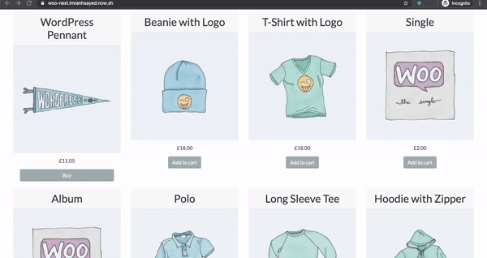
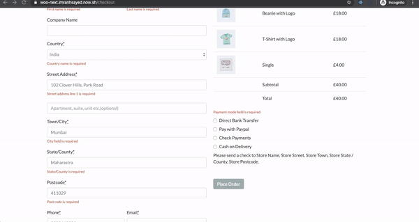

# [WooCommerce Nextjs React Theme](https://woo-next-imranhsayed.vercel.app/) :rocket:

> * This is a React WooCommerce theme, built with Next JS, Webpack, Babel, Node, GraphQl

## 版本节点标记
- 001_NextJS14_Upgrade: Next.js 14升级完成，修复Link组件用法问题（2024年7月16日）

## 组件升级与新增情况

### 框架升级
- **Next.js**: 从v10.2.0升级到v14.1.0
- **React**: 从v17升级到v18.2.0
- **Tailwind CSS**: 升级到v3.x版本并更新配置

### 组件升级
- **Link组件**: 修复所有Link组件的用法，适配Next.js 14规范
- **ApolloClient**: 更新到最新版本，优化GraphQL查询处理
- **HeroCarousel**: 修复轮播组件，确保在新版本框架下正常显示

### 新增组件
- **ProfileDropdown**: 新增用户个人资料下拉菜单组件
  - 功能：显示用户登录/注册、个人资料等选项
  - 支持移动端自适应
  - 支持暗黑模式切换
  - 点击外部区域自动关闭

### 导航菜单改进
- 重构导航菜单，增加移动端响应式支持
- 添加侧边栏折叠功能
- 优化菜单项布局和间距
- 增强用户交互体验

### UI/UX优化
- 统一使用Tailwind系统字体，无额外字体加载
- 优化移动端显示效果
- 改进组件间距与对齐方式
- 添加平滑过渡动画效果

📹 [Full Course Video Tutorial](https://codeytek.com/course/woocommerce-with-react-course/)

## Important Note ⭐:
The code for the Video Tutorial is in the branch [youtube-course](https://github.com/imranhsayed/woo-next/tree/youtube-course)
However, since there is continuous contribution and updates to this project. The 'master'
branch is upto date with those changes. You can also refer to the PR notes for changes.

## Demo Desktop :video_camera:

## Live Demo:

[Live Demo Site](https://woo-next-imranhsayed.vercel.app/)

## Checkout Page Demo

## Payment Demo ( Paypal example )

## Order Received Demo

## Stripe Checkout 
[Stripe Demo Video](https://youtu.be/i75_Vtx-CnA)

# Features:

1. WooCommerce Store in React( contains: Products Page, Single Product Page, AddToCart, CartPage and Checkout Page with country selection ).
2. SSR
3. SEO friendly
4. Automatic Code Splitting
5. Hot Reloading
6. Prefetching
8. Incremental Static (Re)generation ( Next.js 10 support )
9. GraphQL with Apollo Client
10. Tailwindcss
11. Stripe Checkout ( with Stripe Session and Stripe webhook)

## Getting Started :rocket:

These instructions will get you a copy of the project up and running on your local machine for development purposes.

### Prerequisites :page_facing_up:

### Installing :wrench:

1. Clone this repo using terminal `git clone git@github.com:imranhsayed/woo-next`
2. `cd woo-next`
3. `yarn install`

## Add GraphQl support for WordPress

1. Download and activate the following plugins , in your WordPress plugin directory:

* [wp-graphql](https://github.com/imranhsayed/woo-next/tree/master/wordpress/plugins) Exposes graphql for WordPress ( **Tested with v-1.3.8** of this plugin )
* [wp-graphql-woocommerce](https://github.com/imranhsayed/woo-next/tree/master/wordpress/plugins) Adds Woocommerce functionality to a WPGraphQL schema ( **Tested with v-0.8.1** of this plugin )
* [headless-cms](https://github.com/imranhsayed/woo-next/tree/master/wordpress/plugins) Extends WPGraphQL Schema ( **Tested with v-1.8.0** of this plugin )

* Make sure Woocommerce plugin is also installed in your WordPress site. You can also import default wooCommerce products that come with wooCommerce Plugin for development ( if you don't have any products in your WordPress install ) `WP Dashboard > Tools > Import > WooCommerce products(CSV)`: The WooCommerce default products csv file is available at `wp-content/plugins/woocommerce/sample-data/sample_products.csv`

## Hero Carousel.
To use Hero carousel, create a category called 'offers' from WordPress Dashboard > Products > Categories.
Now create and assign as many child categories to this parent 'offers' category with name, description and image.
These Child categories data will automatically be used to create hero carousel on the frontend.

## Configuration(for GraphQL implementation) :wrench:

* _Note_ Below is for GraphQL implementation , for REST API check [feature/rest-api](https://github.com/imranhsayed/woo-next/tree/feature/rest-api) branch

1. (Required) Create a `.env` file taking reference from `.env-example` and update your WordPressSite URL.
- `NEXT_PUBLIC_WORDPRESS_URL=https://example.com`

## Branch details

1. [feature/rest-api](https://github.com/imranhsayed/woo-next/tree/feature/rest-api) Contains REST API Implementation.

2. The `master` branch has the GraphQL implementation.

## Common Commands :computer:

* `dev` Runs server in development mode

## Code Contributors ✰

Thanks to all the people who contributed to the code of this project 🤝

    
    
    
    

## Contributing :busts_in_silhouette:

Please read [CONTRIBUTING.md](https://gist.github.com/PurpleBooth/b24679402957c63ec426) for details on our code of conduct, and the process for submitting pull requests to us.

## Versioning :bookmark_tabs:

I use [Git](https://github.com/) for versioning.

## Author :bust_in_silhouette:

* **[Imran Sayed](https://twitter.com/imranhsayed)**

## License :page_with_curl:

This project is licensed under the MIT License - see the [LICENSE.md](LICENSE.md) file for details

//节点标记 tag 002 图片轮播正常显示//
//2//
